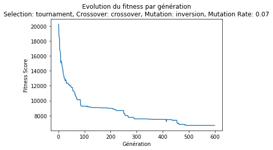
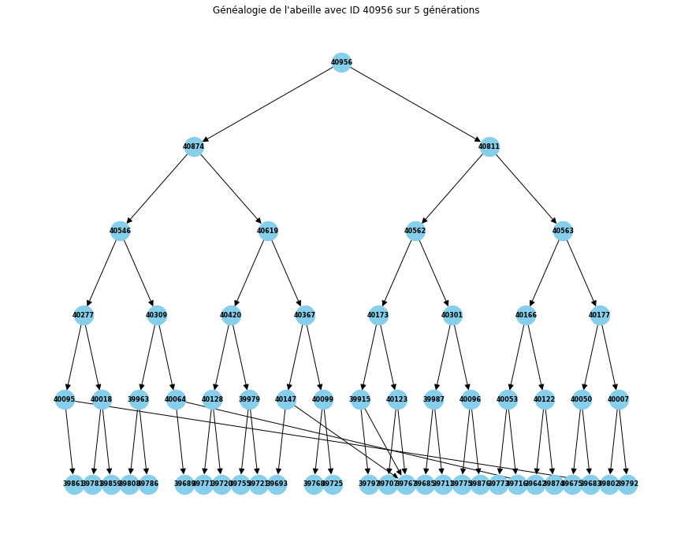
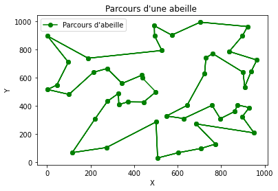

# miel-abeilles

Il s'agit d'un projet porté sur la conception d'un algorithme génétique de type voyageur. 

**Contexte :**  
Nous avons une ruche constituée de 101 abeilles (100 abeilles et leur reine). Autour de la ruche se trouvent 50 fleurs que les 100 abeilles doivent parcourir afin de les butiner sans jamais devoir repasser deux fois sur la même fleur. Chacune des abeilles ont leur propre parcours et de ce fait, certaines abeilles vont parcourir les fleurs beaucoup vite que d'autres. 

**Sujet:**  
Concevoir un algorithme génétique afin de pouvoir créer au fil de génération des abeilles capablent de trouver le chemin le plus court pour parcourir les 50 fleurs. 

**Qu'est-ce qu'un algorithme génétique?**  

**Définition**  

Il s'agit d'un algorithme s'inspirant de la théorie de Darwin sur l'évolution des espèces qui repose sur trois principes :  
* **le principe de variation :** Chaque individu au sein d’une population est unique. Ces différences, plus ou moins importantes, vont être décisives dans le processus de sélection. 
* **le principe d'adaptation :** Les individus les plus adaptés à leur environnement atteignent plus facilement l'âge adulte. Ceux ayant une meilleure capacité de survie pourront donc se reproduire davantage.  
* **le principe d'hérédité :** Les caractéristiques des individus doivent être héréditaires pour pouvoir être transmises à leur descendance. Ce mécanisme permettra de faire évoluer l’espèce pour partager les caractéristiques avantageuse à sa survie.
*(https://igm.univ-mlv.fr/~dr/XPOSE2013/tleroux_genetic_algorithm/fonctionnement.html)*

**Algorithme génétique et Data Science**  
En data science, cet algorithme va être utilisé dans des cas d'optimisation de modèles, de sélection de fonctionnalités, ou de la calibration de paramètres pour améliorer les performances des modèles.  
Ces algorithmes reposent sur des concepts tels que la création d'une populations, la reproduction par croisement, la mutation, et la sélection basée sur la qualité des performances.  

Il s'agit une approche heuristique *(c'est une stratégie pratique qui vise à trouver des solutions satisfaisantes dans des situations où la recherche de la solution optimale pourrait être difficile ou coûteuse en termes de temps de calcul)* pour résoudre des problèmes complexes d'optimisation et de recherche. 

Comme nous le montre ce schéma, l'algorithme repose sur trois étapes:  
* L'évaluation
* La sélection
* Le croisement et la mutation

Pour ce projet, l'évaluation de la qualité d'une abeille va reposer sur son fitness score. Dans notre cas, le fitness score représente la distance totale parcourue par chaque abeille pour traverser les 50 fleurs.
Plus la valeur du fitness score sera basse, meilleure sera l'abeille.  

Pour calculer la distance entre chaque fleur et partant du principe qu'elles sont représentées par des coordonnées (x,y), j'ai choisi d'utiliser la distance euclidienne.  

La formule de la distance euclidienne entre deux points \( (x_1, y_1) \) et \( (x_2, y_2) \) est donnée par :

$$ \text{Distance Euclidienne} = \sqrt{(x_2 - x_1)^2 + (y_2 - y_1)^2} $$  

Il existe plus techniques de sélection, de croisement et de mutation. Pour ce projet, j'ai décidé de tester plusieurs de ces techniques et de les comparer afin de trouver la combinaisons optimale qui va le permettre d'obtenir le fitness score le plus bas. Après avoir sélectionné, la combinaison optimale, j'ai testé différent taux de mutation puis augmenté le nombre de génération jusqu'à arrivé à stagnation de mon modèle.  

**Méthodes de Sélection :**  

**Sélection par fitness score :**  

On sélectionne les meilleurs individus de la population en fonction de leur score de fitness.  

**Tournoi :**  
Organise un tournoi parmi un certain nombre d'individus choisis au hasard et on sélectionne le gagnant en fonction de son fitness score.

**Roulette Wheel Selection :**  
On sélectionne un individu de la population en fonction de la probabilité proportionnelle à son fitness score .

**Méthodes de Croisement :**  

**Croisement en un point :**  
Effectue un croisement entre deux parents pour produire deux enfants.
Méthode Utilisée : Crossover à un point avec des indices de début et de fin choisis au hasard.  

  

**Croisement en deux points :**  

Description : Effectue un croisement à deux points entre deux parents pour produire deux enfants.
Méthode Utilisée : Crossover avec deux points de coupure définis de manière arbitraire.  

  

**Méthodes de Mutation :**  

La méthode de mutation ne s'enclenchera dans le code que lorsque le fitness score stagnera sur 50 générations.  

**Swap :**  

  

On effectue une mutation en échangeant deux gènes dans le parcours.  

**Reversion :**  

  

On effectue une mutation en inversant l'ordre d'une séquence de gènes dans le parcours.  

**Insertion :**  

  

On effectue une mutation en insérant un gène à un nouvel emplacement dans le parcours.  

**L'ensemble des tests que j'ai réalisé se trouvent dans le notebook du répertoire "exploratory.ipynb". J'ai également testé l'algorithme de Dijkstra** *(C'est un algorithme utilisé en informatique pour trouver le plus court chemin entre deux nœuds dans un graphe pondéré.*) **afin de comparer mes résultats obtenus avec mon algorithme génétique.**  

**Conclusion :**  

La meilleure combinaison retenue est celle-ci:  
* Sélection : **Tournoi**
* Croisement : **Croisement en un point**
* Mutation : **Inversion**
* Taux de mutation : **0.07%**
* Fitness_score : **6679.80 sur 600 générations.**

## Fitness Score par génération :  

  

## Arbre généalogique:  

  

## Meilleur parcours:  

  

  

